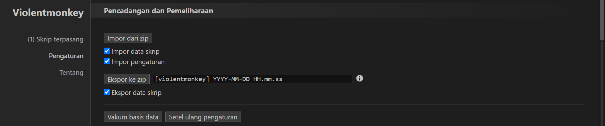

---

<h1 align="center">Sunflower Land Extension Bot</h1>

Automate tasks in Sunflower Land to streamline your gameplay and maximize your efficiency!

---

## 🚀 **About the Extension**

The **Sunflower Land Extension Bot** is designed to automate various tasks in [Sunflower Land](https://sunflower-land.com/play/), including:

- **Automatic Farming**: Harvest and replant your crops automatically – just select your seed.
- **Automatic Mining**: Mine stone, iron, and gold without manual intervention.
- **Automatic Wood Cutting**: Chop trees effortlessly.
- **Notepad Feature**: Keep track of your notes directly within the extension.
- **Teleport Feature**: Instantly teleport to various in-game locations (currently limited).
- **Fishing Recipe Feature**: Apply fishing recipes to enhance your gameplay.

This extension helps you save time and focus on enjoying the game by automating repetitive tasks.

---

## 🌟 **Version v1.0.0**

### **Updates**

- **Initial Release**: Full automation features for farming, mining, wood cutting, notepad, teleport, and fishing recipes.

### **Upcoming Updates**

- Expanded teleport locations.
- Additional customization options.
- Bug fixes and performance enhancements.

Stay tuned for more updates!

---

### **Features in This Version**:

- **Auto Farming**: Automatically harvests and replants your crops.
- **Auto Mining**: Mines stone, iron, and gold seamlessly.
- **Auto Wood Cutting**: Chops trees without manual input.
- **Notepad**: Integrated notepad for your personal notes.
- **Teleport**: Teleports you to preset locations (limited functionality).
- **Fishing Recipe**: Utilizes fishing recipes to boost your gameplay.

---

## 📖 **Installation Steps**

Follow these steps to install the Sunflower Land Extension Bot:

1. **Install Violent Monkey**  
   Download and install the Violent Monkey extension from the Chrome Web Store:  
   [Violent Monkey on Chrome Web Store](https://chromewebstore.google.com/detail/violentmonkey/jinjaccalgkegednnccohejagnlnfdag)

2. **Download the Extension**  
   Download the ZIP file from the GitHub repository.

3. **Import the Extension**  
   - Click on the **Violent Monkey** icon in your browser.
   - Click on the **gear (settings)** icon.
   - Scroll down to the bottom.
   - Click on the **Import** button.
   - Select and import the downloaded ZIP file.
     Example
     

4. **Enjoy the Extension**  
   Once imported, the extension is ready to enhance your gameplay on [Sunflower Land](https://sunflower-land.com/play/).

---

## 🛠️ **Contributing**

This project is developed by **Sunflower Land Extension Bot Team**. If you have suggestions, questions, or would like to contribute, feel free to reach out:

  

